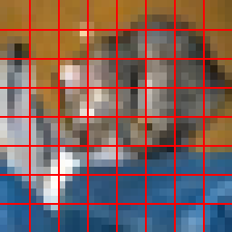

# TokenScope-ViT

一个用于学习和研究视觉 Token 的 PyTorch 项目。项目从 CIFAR-10 图片的 Patchify 开始，逐步实现 ViT，并进一步研究视觉 Token 的可解释性、图像退化鲁棒性与推理剪枝。

**当前阶段：**已完成 CIFAR-10 线性分类基线，以及 Patchify、图片还原、网格可视化和简化 ViT 输入的形状追踪。TinyViT 和 Token 剪枝尚未实现。

## 当前功能

- 加载 CIFAR-10，使用 `DataLoader` 组织训练和测试数据。
- 训练一个 `LinearClassifier`，评估测试集，并保存模型权重。
- 将 `32×32` RGB 图片切成不重叠的 `4×4` Patch；把 Patch 拼回原图并验证结果完全一致。
- 绘制第一张测试图片的 `8×8` Patch 网格。
- 演示 Patch 投影、CLS Token 拼接和位置向量相加时的张量形状。

分类结果来自训练后的 `LinearClassifier`。Patch 投影层和位置表目前是随机初始化的，用于理解 ViT 输入流程；它们尚未组成经过训练的 ViT 分类模型。

## 张量形状

以下示例使用 8 张 `32×32` RGB 图片，Patch 大小为 4，投影维度为 20。

| 步骤 | 张量形状 | 含义 |
|---|---|---|
| 图片 batch | `[8,3,32,32]` | 8 张、3 通道的图片 |
| 原始 Patch 向量 | `[8,64,48]` | 每张图有 64 块；每块有 `3×4×4=48` 个像素值 |
| Patch 投影 | `[8,64,20]` | 每块投影为 20 维；Patch 数量不变 |
| 加入 CLS Token | `[8,65,20]` | 在 64 个 Patch 前增加 1 个 CLS 占位符 |
| 加入位置向量 | `[8,65,20]` | 逐元素相加，形状不变 |

## 环境

已验证的开发环境：

- Python 3.11.5
- PyTorch 2.14.0+cu126
- CUDA 12.6
- NVIDIA GeForce RTX 4060 Laptop GPU，8 GB 显存
- Windows

项目使用 PyTorch、Torchvision 和 Pillow。训练脚本会优先使用 CUDA；没有可用 CUDA 时使用 CPU。

## 运行

在仓库根目录依次执行：

```bash
python environment_check.py
python inspect_cifar10.py
python train.py
python inspect_checkpoint.py
```

`inspect_cifar10.py` 会尝试下载并检查 CIFAR-10，需要网络连接。如果数据已经下载，可跳过这一步。

`train.py` 训练线性分类器、评估测试集，并将权重保存到用户目录下的 `.cache/tokenscope-vit/linear_cifar10.pt`。`inspect_checkpoint.py` 会读取该权重，检查预测结果，并运行 Patchify 与简化 ViT 输入演示。因此，首次运行 `inspect_checkpoint.py` 前需先运行 `train.py`。

## Patch 网格示例

下图展示了 `32×32` 图片按 `4×4` Patch 划分后的网格：



## 关键文件

```text
tokenscope-vit/
├── models/
│   ├── __init__.py
│   ├── linear_classifier.py
│   └── patchify.py
├── outputs/
│   └── patch_grid.png
├── environment_check.py
├── inspect_cifar10.py
├── inspect_dataloader.py
├── inspect_checkpoint.py
├── train.py
├── README.md
└── LICENSE
```

`models/` 保存模型与 Patchify 的代码；训练得到的权重保存在上述缓存目录中。

## 后续计划

- [x] CIFAR-10 数据加载与环境检查
- [x] 线性分类器训练、测试与权重保存
- [x] Patchify、原图还原与网格可视化
- [x] 简化 ViT 输入形状追踪
- [ ] 实现并训练 TinyViT
- [ ] 使用 Hook 提取中间视觉 Token 与 attention
- [ ] 评估低光、模糊、雾霾和遮挡等图像退化
- [ ] 实现视觉 Token 剪枝与恢复，并比较准确率和推理开销
- [ ] 整理实验报告与可复现结果